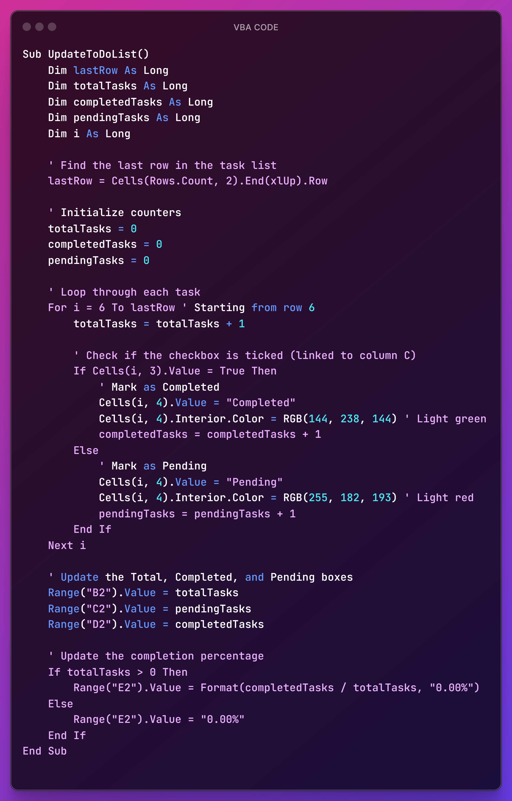

# ✅ To-Do List Project (Excel + VBA)

## 📌 Project Overview
This project is a **To-Do List** created using **Microsoft Excel** and **Visual Basic for Applications (VBA)**. It was developed as part of the college curriculum for the **Bachelor of Computer Applications (BCA)**, Semester 3.

The main aim of the project is to demonstrate how Excel, combined with VBA, can be used to create a powerful and customizable task management tool that helps users stay organized, track progress, and manage deadlines effectively.

## ✨ Features
- **Task Listing**: Easily add and list tasks.
- **Due Dates**: Set deadlines for each task.
- **Progress Tracking**: Mark tasks as Pending or Completed.
- **Sorting and Filtering**: Organize tasks by priority, due date, or status.
- **Customization**: Color-code tasks, highlight important activities, and personalize the list.
- **Automation with VBA**: Simplify repetitive tasks and improve functionality.

## 🛠️ Software Requirements
- Microsoft Excel
- Visual Basic for Applications (VBA)
- (Optional) Microsoft 365

## 💻 Hardware Requirements
- **Processor**: Intel Core i3 / AMD Ryzen 3  
- **RAM**: 4 GB  
- **Storage**: 4 GB available space  
- **Display**: Full HD (1080p)  
- **Keyboard and Mouse**

## ✅ Advantages
- **Automation**: VBA scripts automate sorting, filtering, and reminders.
- **Customization**: Highly flexible design tailored to user needs.
- **Offline Access**: No internet required.
- **Easy Integration**: Can interact with Microsoft Outlook and other Office apps.

## ⚠️ Disadvantages
- **Learning Curve**: VBA requires programming knowledge.
- **Limited Real-Time Collaboration**: Not ideal for multi-user environments.
- **Maintenance Needed**: VBA code must be updated with Excel version changes.
- **Security Risks**: Macros can be vulnerable if not properly managed.

## 📂 Project Structure
- **Excel Sheet**: Contains task list and formatting.
- **VBA Code**: Automates task management operations.
- **Screenshots**: Visual representation of the project and code.
- **Download Link**: `TO-DO_List.xlsx` file for use.

## 🖼️ Screenshots

### 🧾 To-Do List Layout

---

### 💻 VBA Code Editor

---

## 🎓 Certificate
Certified by **L J University**, School of Computer Applications, Department of BCA

## 👨‍💻 Developer
- **Name**: Vaghela Purvarajsinh Kuldeepsinh

---

> This project showcases how Excel and VBA can be combined to build simple yet efficient desktop-based productivity tools for everyday use.
